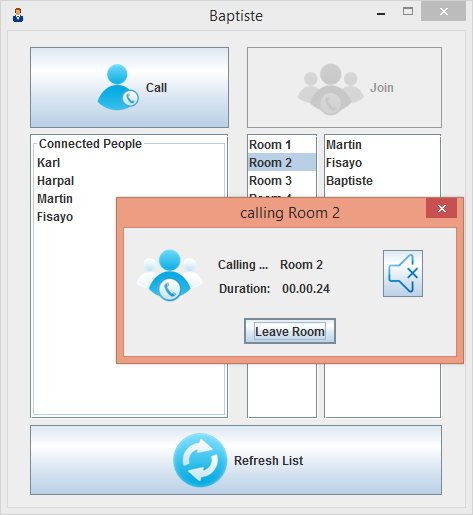

M7017E_LAB2
===========

LAB2 M7017E audio conference tool.

This project is about LAB2 of the course M7017E Multimedia Systems, proposed by Karl Anderson for Luleå University of Technology (LUT). 
The objective of this Lab is sending and receiving media information on the network by using the GStreamer Framework [1]. To achieve this, an audio conference tool has be developed. 
The development team comprised of three international students. Baptiste Louis and Fisayo Sangogboye respectively from France and Nigeria are undergoing an Erasmus Mundus PERCCOM program. The third member, Martin Bumba is from Czech Republic and he is undergoing a master program in distributing systems and web development. 

All information about the code is available in the doc folder of this project.

By Baptiste Louis, Martin Bumba and Fisayo Sangogboye, Lulea - December 2014.
